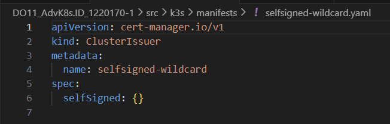
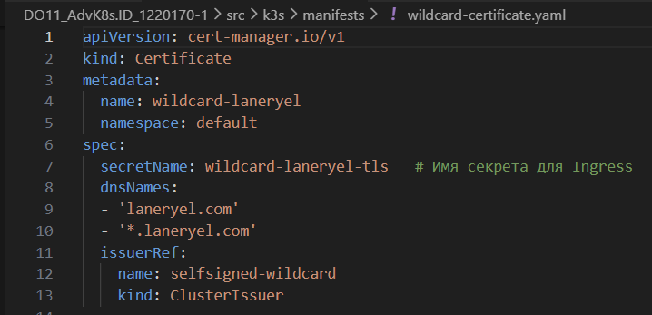
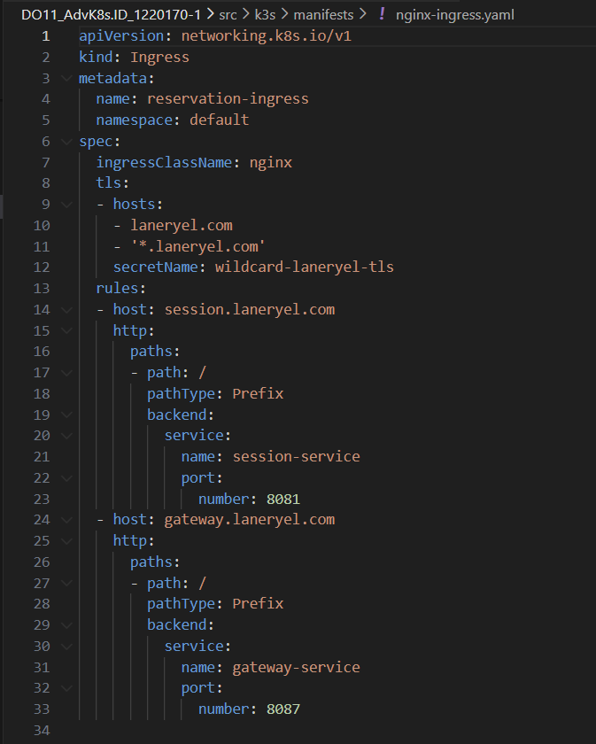
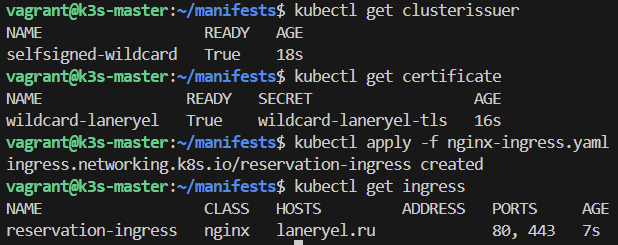
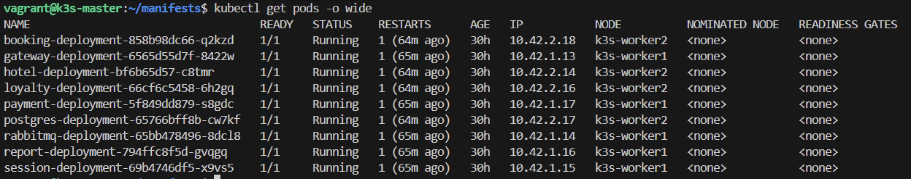
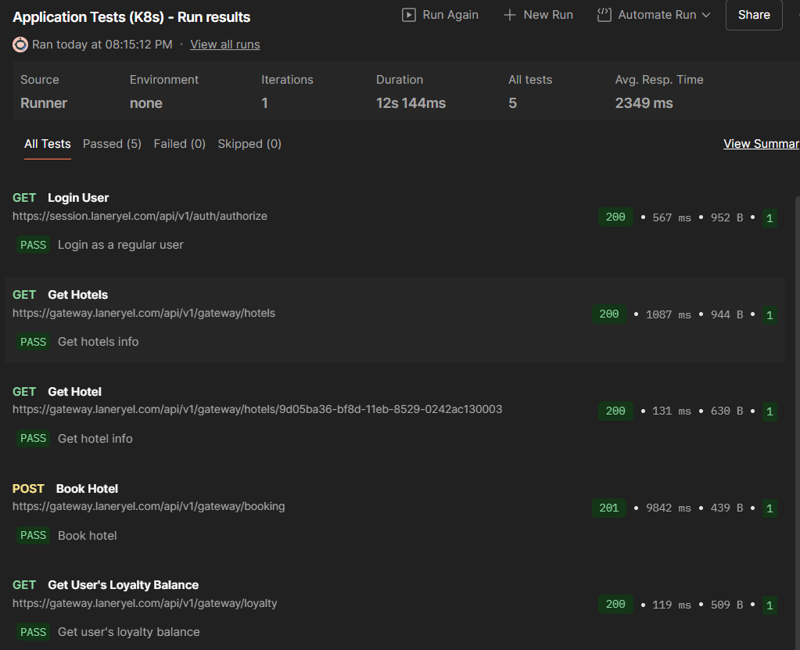
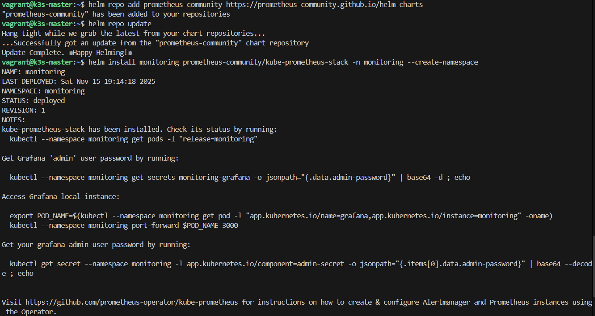
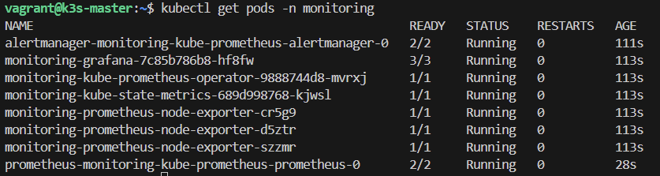

## Part 1. Развертывание собственного кластера k3s
1) Получаем набор виртуальных машин для кластера, для этого используем `Vagrant`  
    - Пишем конфиг вагранта  
      
    - Смотрим статус  
      
2) Устанавливаем `k3s` на всех трех машинах, при этом используем флаг `--disable=traefik`, чтобы не устанавливать стандартный Ingress Controller k3s  
    - Сначала мастер нода
      
    Берем токен для воркеров при помощи <screens/pre>sudo cat /var/lib/rancher/k3s/server/node-token<screens//pre>  
    - Теперь воркеры
      
      
3) Выполняем подключение узлов к кластеру. Для воркеров используем переменную окружения `NODE_TOKEN`
    - на мастере
      
    - на воркерах  
    
    
    Смотрим, что все встало как надо  
    
4) Устанавливаем Ingress Controller Nginx вместо стандартного с github
    
5) Получаем доменное имя и конфигурируем внутри кластера утилиту cert-manager, которая должна генерировать wildcard-сертификат для полученного домена  
    - Установка `cert-manager` при помощи  
    <pre>kubectl apply -f https://github.com/cert-manager/cert-manager releases/download/v1.17.1/cert-manager.yaml</pre>
    - Пишем `clusterissuer`, выдающий самоподписанные сертификаты  
    
    - Пишем `cerificate`, чтобы запросить сертификат  
      
6) Создаем `Ingress` для своего личного домена и настраиваем его для использования контроллера `nginx ingress` и полученного сертификата.  
    
7) Создаем PV и PVC для `postgres`  
    
8) Применяем манифесты и запускаем приложение  
    
    
    
    
9) Запускаем функциональные тесты Postman, чтобы удостовериться в работоспособности приложения, для этого немного меняем конфигурацию тестов, чтобы запросы шли не по `localhost:port, а по домену`  
      
10) Устанавливаем и запускаем `Prometheus Operator` в отдельный `namespace`, показываем результат команды `kubectl get pods -n monitoring`
    
    